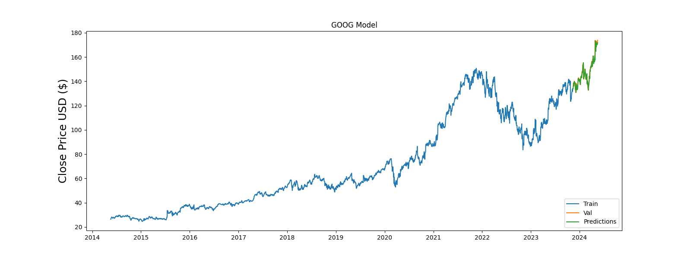

## StockSeer-API  `(Stock Price Prediction API)`


[](https://github.com/psf/black) 
[](LICENSE)

This project is a FastAPI application that predicts the closing stock price for a given company based on user-specified parameters. It utilizes various machine learning models for prediction, including:

* RandomForestRegressor 🌳
* ExtraTreesRegressor 🌲
* XGBRegressor 🚀
* LinearRegression ➖
* KNeighborsRegressor 🤝
* LSTM implementation 🔄

## Data Source:

This application utilizes the Yahoo Finance API to retrieve historical stock data for training and prediction purposes.

## Features✨

* Download and preprocess historical stock data
* Train a stock price prediction model of your choice
* Make predictions on future closing stock prices


## Working Prototype 
**Example: Predicting oogle
 Stock Price**

| Input | Response|  raph |
|------|---------|---------|
||| |

## Installation

1. Ensure you have Python installed.
2. Create a new virtual environment (recommended).
3. Activate the virtual environment.
4. Install required dependencies:

```bash
pip install -r requirements.txt
```

## Usage

1. Run the application:

```bash
uvicorn app:app --reload
```

2. Access the API documentation in your web browser: http://127.0.0.1:8000/docs

The documentation provides instructions on interacting with the API to make predictions.


## Credits

* **Maira Usman:**  Developed the GUI for this project. You can find the code here: Link to [StockSeer-Frontend](https://github.com/Myrausman/StockSeer-Frontend).

## Disclaimer

**Important:** Stock price prediction is inherently uncertain. This application should not be used for making financial decisions. 
